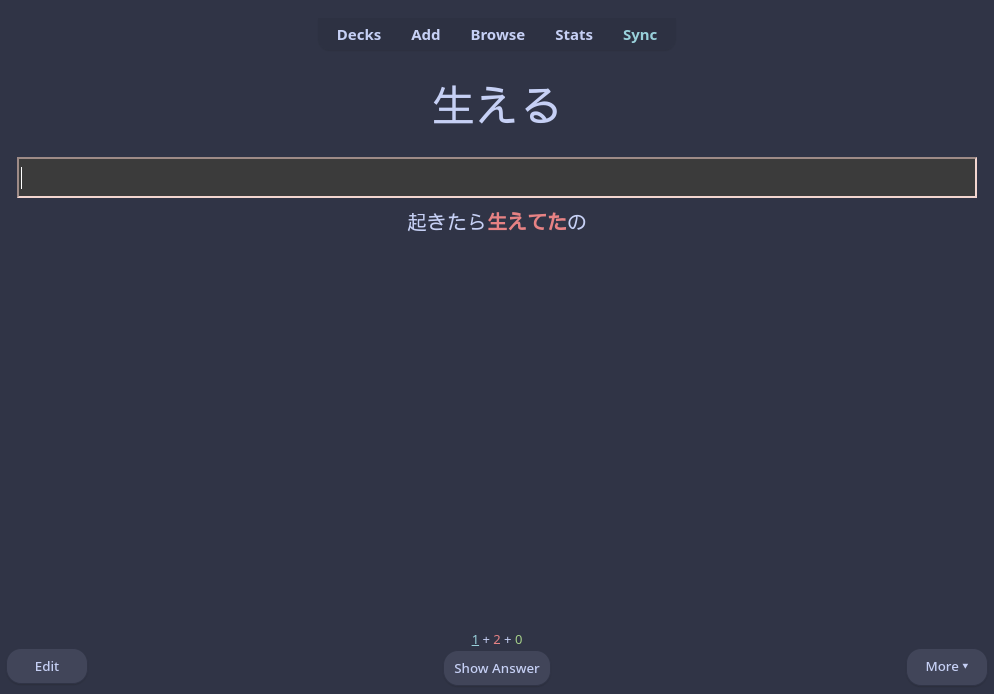
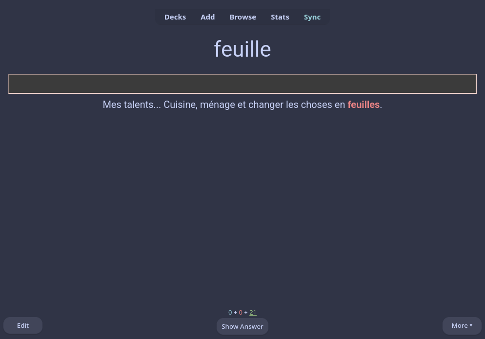
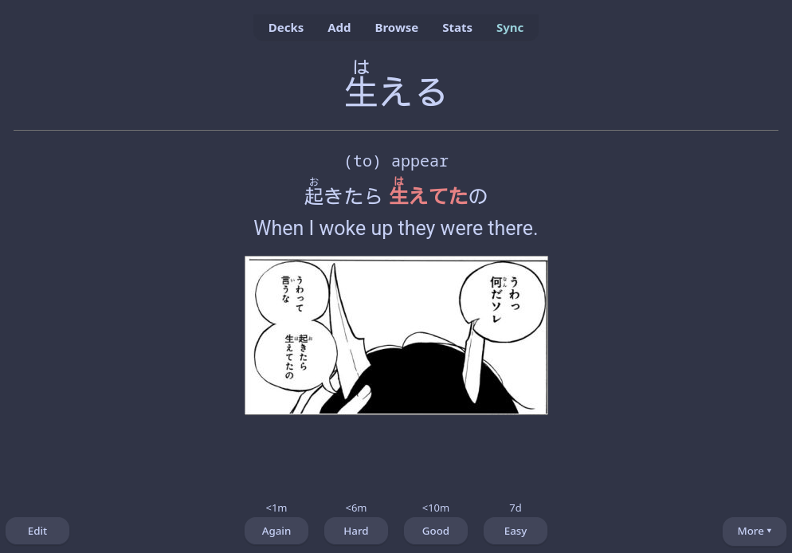
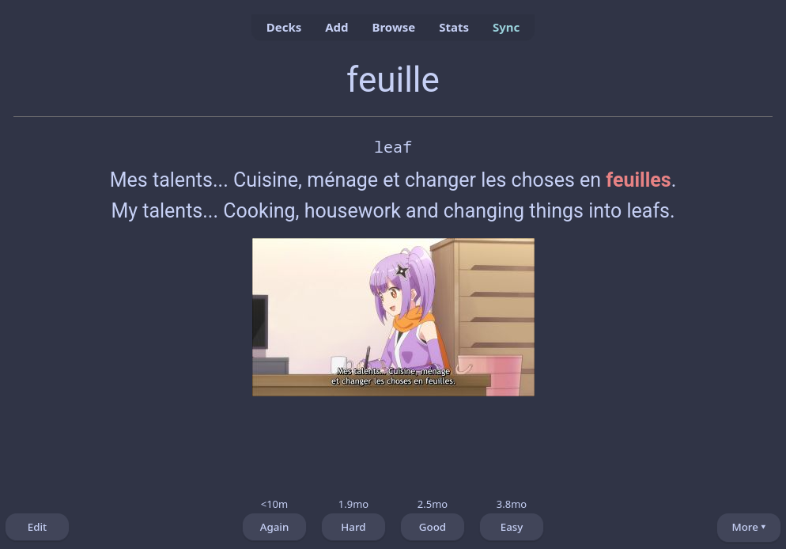

# About
My Anki Note types

# Showcase

| Japanese      | French        |
| :-------------: | :-------------: |
|   |    |
|    |    |

# Set up
1. In Anki click onto `Tools > manage note types`
2. create a new note type 
    - click `add` then `basic` then `ok` 
3. add the following fields to it: 
    1. `Word` 
    2. `Word Meaning` 
    3. `Sentence` 
    4. `Sentence Meaning` 
    5. `Picture` 
    6. `Notes`
4. click `save` 
5. open `cards` 
    1. In `Front Template` paste `FrontTemplate.html` 
    2. In `Back Template` paste `BackTemplate.html` 
    3. In Styling paste `Styling.css` 
6. click `save`

# Credits
[Kaishi 1.5k](https://github.com/donkuri/Kaishi/)
