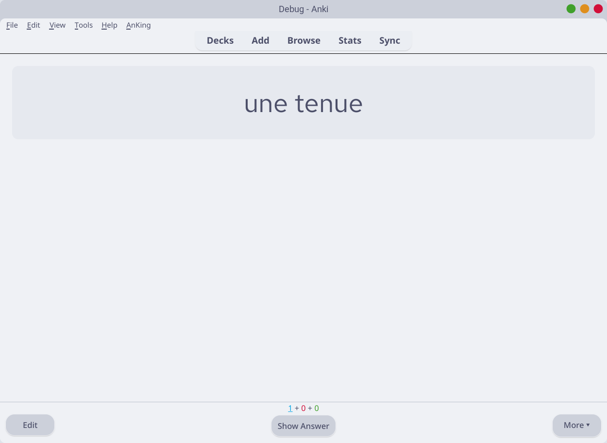
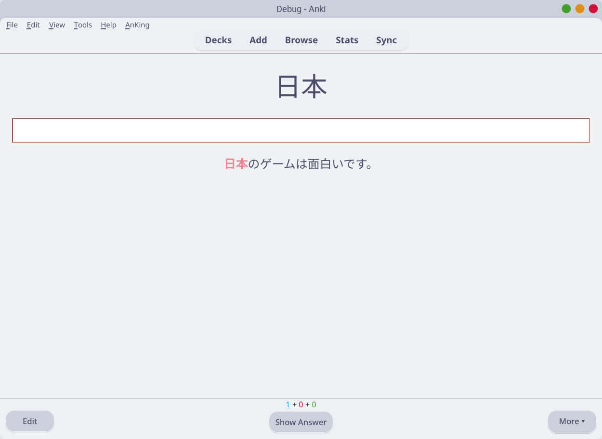
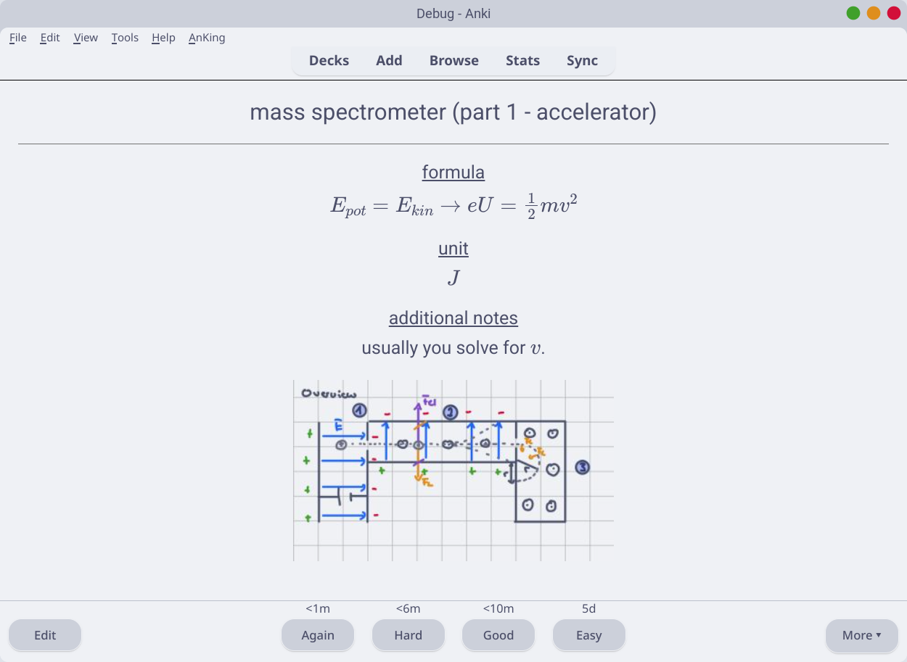

# About
My Anki Note Types

# Showcase
## [Main Note Type](src/Word%20Mining/)
| Front                                                  | Back                                                 |
| :----------------------------------------------------: | :--------------------------------------------------: |
|   |  |

## Others
|[Physics](src/physics/)                              |[Kaishi 1.5k (type in)](src/Kaishi%20type%20in/)               |
|:--------------------------------------------------:|:-------------------------------------------------------------:|
|   ||
|    | |

# Installation
1. Download the `.apkg` files you want from the [release page](https://github.com/anki-note-types) or the [release folder](release/).
2. Open Anki and click on `Import file`.
3. Select the `.apkg` you downloaded.

# Credits
[Word Mining](src/Word%20Mining/) was inspired by [Lapis](https://github.com/donkuri/lapis).  
[Kaishi 1.5k (type in)](src/Kaishi%20type%20in/) is a modification of [Kaishi 1.5k](https://github.com/donkuri/Kaishi/).
